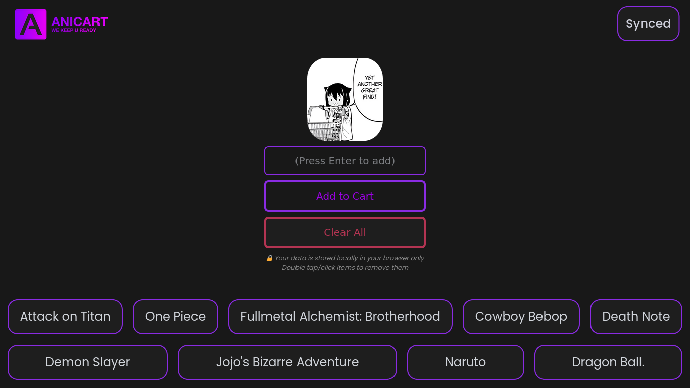

<p align="center">
  
</p>

[](https://opensource.org/licenses/MIT)
[](https://firebase.google.com/)
[](http://makeapullrequest.com)

A sleek, modern web application for anime and manga enthusiasts to manage their watchlists with real-time synchronization across devices. Built with vanilla JavaScript and Firebase.



## Table of Contents
- [Features](#features)
- [Quick Start](#quick-start)
- [Usage](#usage)
- [Firebase Setup](#firebase-setup)
- [Development](#development)
- [Contributing](#contributing)
- [License](#license)
- [Author](#author)

## ✨ Features

- 📝 Create and manage anime/manga watchlists
- 🗑️ Easy deletion with double-click/tap
- 🔄 Real-time cross-device sync via Firebase
- 🌙 Dark mode interface with neon accents
- 💾 Local storage backup
- 📱 Responsive design for all devices
- ⚡ Fast and lightweight

## 🚀 Quick Start

1. Clone the repository:
   ```bash
   git clone https://github.com/yourusername/AniCart.git
   ```
2. Open `index.html` in your browser
3. Start adding your favorite anime/manga!

## 💻 Usage

- Type anime/manga title and press Enter or click "Add to Cart"
- Double-click (desktop) or double-tap (mobile) to remove items
- Use "Clear All" for bulk removal
- Enable sync to access your list anywhere

## 🔥 Firebase Setup

1. Click "Sync" in the navigation
2. Create a [Firebase project](https://console.firebase.google.com/)
3. Set up Realtime Database
4. Copy your database URL
5. Paste URL in AniCart sync settings
6. Your list will now sync across devices!

## 🛠️ Development

```bash
# Clone repository
git clone https://github.com/yourusername/AniCart.git

# Navigate to directory
cd AniCart

# Start local server (using Python for example)
python -m http.server 8000
```

## 🤝 Contributing

Contributions are welcome! Please feel free to submit a Pull Request.

1. Fork the Project
2. Create your Feature Branch (`git checkout -b feature/AmazingFeature`)
3. Commit your Changes (`git commit -m 'Add some AmazingFeature'`)
4. Push to the Branch (`git push origin feature/AmazingFeature`)
5. Open a Pull Request

## 📄 License

Distributed under the MIT License. See `LICENSE` for more information.

## 👨‍💻 Author

Built with ❤️ by Maxx

[](https://github.com/Maxxjx)
[](https://github.com/Maxxjx)

---

⭐ Star this repo if you found it helpful!